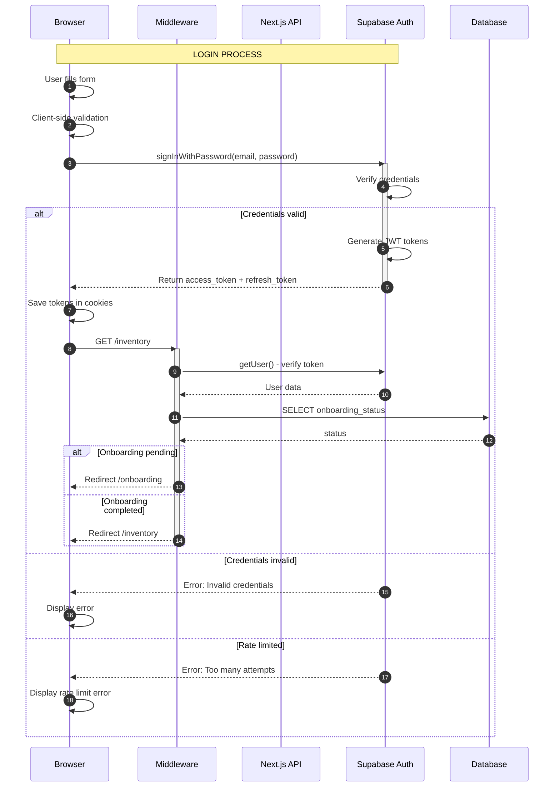
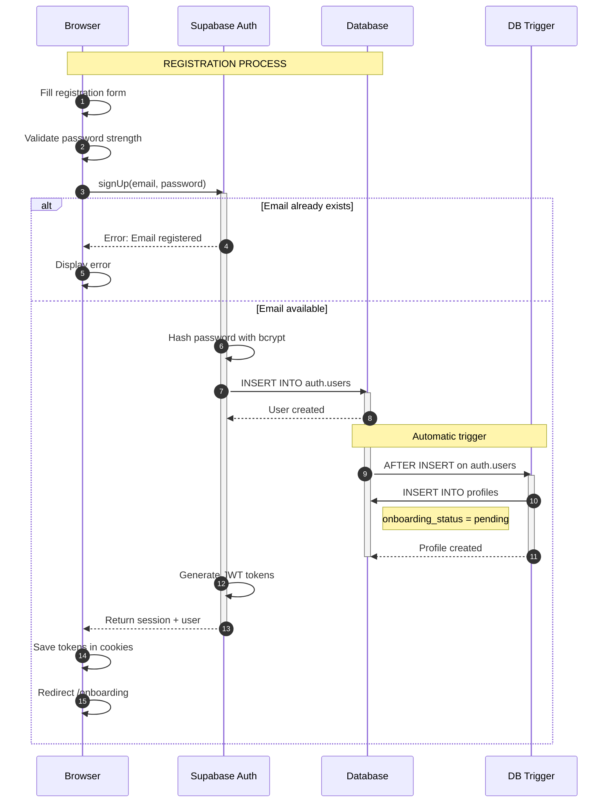
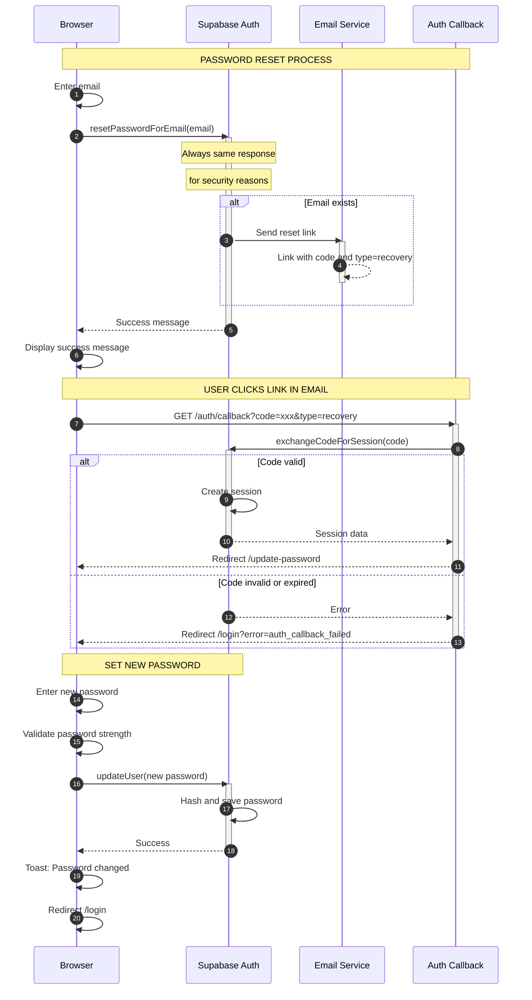
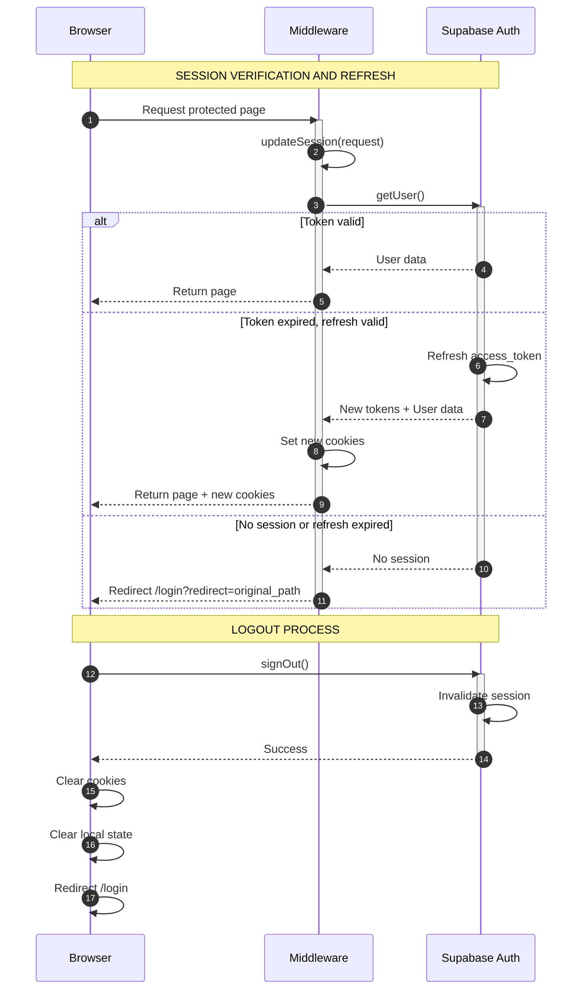
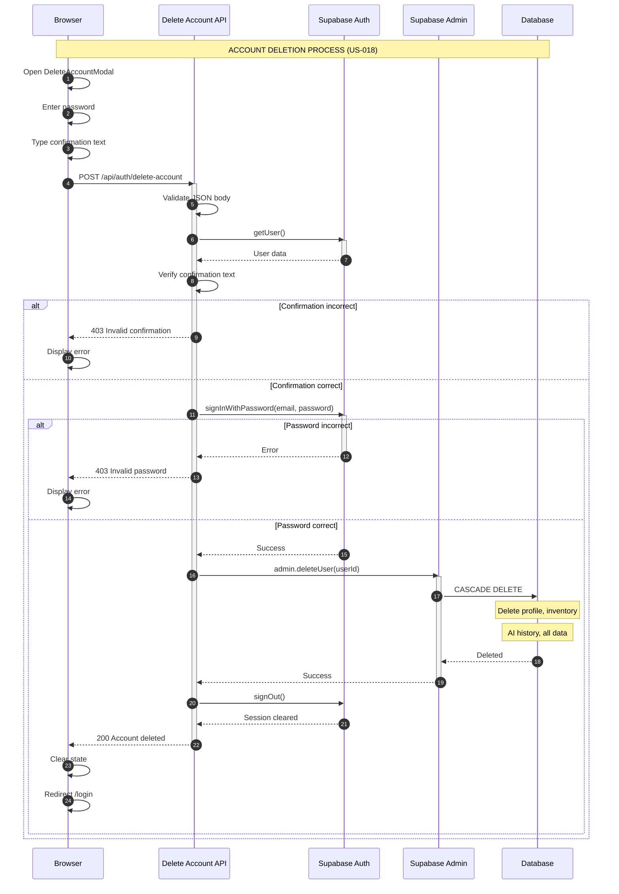

# Authentication Flow Diagram - Mealer

## Analysis

<authentication_analysis>

### 1. Authentication flows mentioned in the specification

1. **Login (US-002)**: Email/password → verification → session → redirect
2. **Registration (US-001)**: Email/password → account creation → profile creation → onboarding
3. **Password Reset (US-003)**: Email → link → callback → new password
4. **Logout (US-004)**: End session → clear cookies → redirect
5. **Account Deletion (US-018)**: Password verification → confirmation → deletion → logout
6. **Token Refresh**: Automatic via middleware on each request

### 2. Main actors and their interactions

| Actor              | Role                   | Interactions                                  |
| ------------------ | ---------------------- | --------------------------------------------- |
| Browser            | User client            | Sends requests, stores session cookies        |
| Next.js Middleware | Intermediary layer     | Verifies session, refreshes tokens, redirects |
| Next.js API        | Application server     | Processes requests, validates data            |
| Supabase Auth      | Authentication service | Manages users, tokens, sessions               |
| Email Service      | Email service          | Sends password reset emails                   |

### 3. Token verification and refresh processes

**Token Verification:**

1. Middleware intercepts every request
2. `supabase.auth.getUser()` verifies JWT token
3. If token expired, attempt refresh via refresh token
4. If refresh fails, redirect to `/login`

**Token Refresh:**

1. Supabase JS client automatically refreshes tokens in background
2. Middleware calls `updateSession()` on every server request
3. New tokens saved in HTTP-only cookies
4. Session lasts 7 days (configurable)

### 4. Authentication steps description

**Login:**

1. User enters email/password
2. Client-side validation (zod schema)
3. `signInWithPassword()` to Supabase
4. Supabase verifies credentials
5. Returns JWT access_token and refresh_token
6. Tokens saved in HTTP-only cookies
7. Redirect to `/onboarding` or `/inventory`

**Registration:**

1. User enters email/password with confirmation
2. Password strength validation (min 8 chars, uppercase/lowercase, digit)
3. `signUp()` to Supabase
4. Supabase creates user in auth.users
5. Database trigger creates profile with `onboarding_status: 'pending'`
6. Redirect to `/onboarding`

**Password Reset:**

1. User enters email
2. `resetPasswordForEmail()` with `redirectTo: /auth/callback?type=recovery`
3. Supabase sends email with link
4. User clicks link → `/auth/callback`
5. Callback exchanges code for session
6. Redirect to `/update-password`
7. User sets new password via `updateUser()`

</authentication_analysis>

## Diagram - Login Process

<mermaid_diagram>

</mermaid_diagram>

## Diagram - Registration Process

<mermaid_diagram>

</mermaid_diagram>

## Diagram - Password Reset

<mermaid_diagram>

</mermaid_diagram>

## Diagram - Session Management

<mermaid_diagram>

</mermaid_diagram>

## Diagram - Account Deletion

<mermaid_diagram>

</mermaid_diagram>

## Security Summary

| Aspect            | Implementation                                |
| ----------------- | --------------------------------------------- |
| Password storage  | Bcrypt via Supabase                           |
| Session tokens    | JWT in HTTP-only cookies                      |
| Cookie attributes | Secure, SameSite=Lax (production)             |
| Rate limiting     | Handled by Supabase Auth                      |
| CSRF              | Protection via SameSite cookies               |
| Password reset    | Uniform message regardless of email existence |
| Account deletion  | Requires password + confirmation text         |
