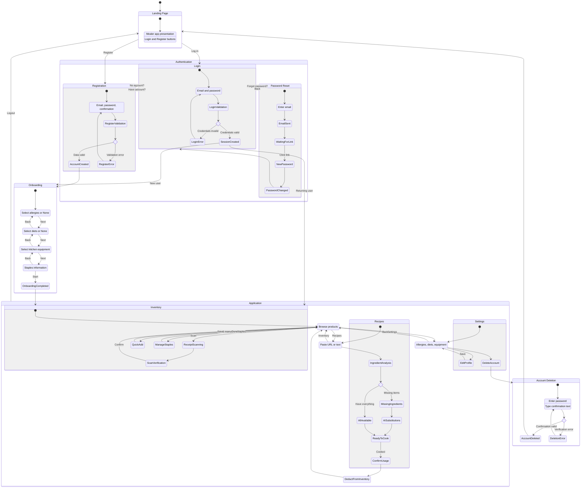
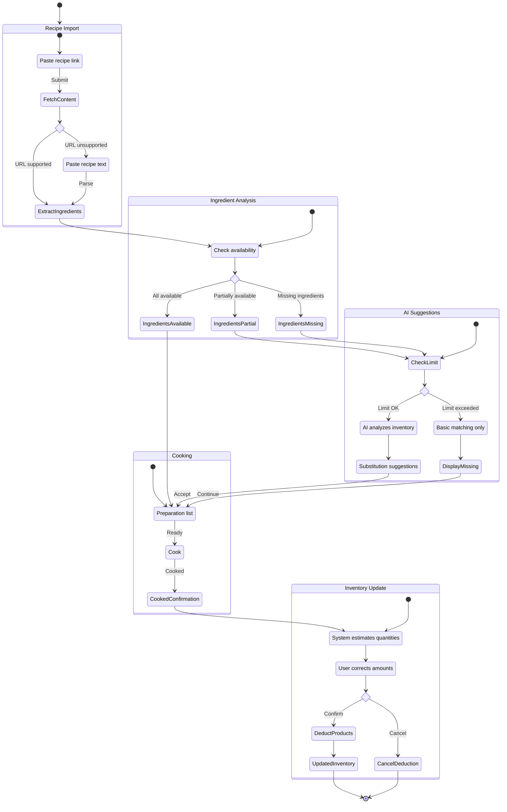

# User Journey Diagram - Mealer

## Analysis

<user_journey_analysis>

### 1. User paths mentioned in the specification

Based on PRD and user stories (US-001 to US-018):

1. **US-001 - Registration**: New user creates account
2. **US-002 - Login**: Returning user logs in
3. **US-003 - Password Reset**: User recovers account access
4. **US-004 - Logout**: User ends session
5. **US-005 - Profile Setup**: Mandatory onboarding (allergies, diets, equipment)
6. **US-006 to US-010 - Inventory Management**: Scanning, verification, viewing, staples
7. **US-011 to US-013 - Recipes**: Import, analysis, cooking
8. **US-018 - Account Deletion**: Permanent data removal

### 2. Main journeys and their states

**New user journey:**

```
Landing page → Registration → Onboarding (4 steps) → Inventory
```

**Returning user journey:**

```
Landing page → Login → Inventory
```

**Password recovery journey:**

```
Login → Reset password → Email → Callback → New password → Login
```

**Main app journey:**

```
Inventory ↔ Recipes ↔ Settings
```

**Account deletion journey:**

```
Settings → Deletion modal → Confirmation → Logout
```

### 3. Decision points and alternative paths

| Decision Point   | Conditions              | Paths                                       |
| ---------------- | ----------------------- | ------------------------------------------- |
| After login      | onboarding_status       | pending → Onboarding, completed → Inventory |
| Login form       | result                  | success → continue, error → retry           |
| Receipt scanning | image quality           | OK → verification, error → retake photo     |
| Recipe analysis  | ingredient availability | all → cook, missing → substitutions         |
| AI limit         | daily limit             | OK → AI feature, exceeded → limitations     |
| Account deletion | confirmation            | correct → delete, incorrect → cancel        |

### 4. Purpose of each state

| State          | Business Purpose                           |
| -------------- | ------------------------------------------ |
| Landing page   | Welcome, encourage registration/login      |
| Registration   | Create user account                        |
| Login          | Access existing account                    |
| Password reset | Recover account access                     |
| Onboarding     | Collect preferences for AI personalization |
| Inventory      | Manage available products                  |
| Scanning       | Quick product addition from receipt        |
| Verification   | Correct AI errors before saving            |
| Recipes        | Import and analyze recipes                 |
| Substitutions  | Suggest replacements based on inventory    |
| Cooking        | Confirm ingredient usage                   |
| Settings       | Manage account and preferences             |

</user_journey_analysis>

## Main Diagram

<mermaid_diagram>



</mermaid_diagram>

## Detailed Diagram - Cooking Flow

<mermaid_diagram>



</mermaid_diagram>

## Diagram - New User Path

```mermaid
stateDiagram-v2
    direction LR

    [*] --> Discovery

    state "App Discovery" as Discovery {
        LandingPage: Mealer landing page
    }

    state "Registration" as Registration {
        EnterEmail: Enter email
        EnterPassword: Create strong password
        ConfirmPassword: Confirm password
        ClickRegister: Click Register
    }

    state "Onboarding" as Onboarding {
        SelectAllergies: Mark allergies
        SelectDiets: Mark diets
        SelectEquipment: Mark equipment
        LearnStaples: Learn about Staples
    }

    state "First Steps" as FirstSteps {
        AddProducts: Scan receipt or add manually
        PasteRecipe: Paste first recipe
        SeeAnalysis: View AI analysis
    }

    state "Regular Use" as RegularUse {
        ManageInventory: Update products
        SearchRecipes: Import recipes
        Cook: Cook and deduct
    }

    Discovery --> Registration: Register
    Registration --> Onboarding: Account created
    Onboarding --> FirstSteps: Start
    FirstSteps --> RegularUse: Familiar
    RegularUse --> [*]: Logout
```

<mermaid_diagram>



</mermaid_diagram>

## Key Success Metrics (from PRD)

| Metric                  | Target       | Related States               |
| ----------------------- | ------------ | ---------------------------- |
| Profile Completion Rate | 90%          | Onboarding → all 4 steps     |
| Weekly Active Usage     | 50% MAU      | Cooking → "Cooked This" flow |
| Scan Latency            | < 10 seconds | Scanning → Verification      |
| AI Accuracy             | < 15% edits  | Scan verification            |

## Error Scenarios

| Scenario           | Error State    | Recovery Path     |
| ------------------ | -------------- | ----------------- |
| Network error      | Error message  | Retry action      |
| Empty inventory    | Add suggestion | Scanning/Adding   |
| AI limit           | Info modal     | Basic matching    |
| Unreadable receipt | Retake request | Scanning          |
| Unsupported URL    | Text fallback  | Paste recipe text |
