# UI Architecture Diagram - Mealer Authentication Module

## Analysis

<architecture_analysis>

### 1. Components mentioned in the specification

**New authentication components:**

- `LoginForm` - login form with email/password validation
- `RegisterForm` - registration form with password strength indicator
- `ResetPasswordForm` - password reset request form
- `UpdatePasswordForm` - set new password form after reset
- `PasswordStrengthIndicator` - visual password strength feedback
- `AuthCard` - wrapper for authentication forms
- `DeleteAccountModal` - account deletion confirmation modal (US-018)
- `AuthProvider` - React context managing authentication state

**shadcn/ui extensions:**

- `Input` - text input with error state support
- `Alert` - success/error message display
- `Form` - form wrapper with react-hook-form integration
- `Dialog` - modal for DeleteAccountModal

**Existing onboarding components:**

- `OnboardingWizard` - main wizard container
- `OnboardingProgressBar` - progress indicator
- `OnboardingStepAllergies` - allergies step
- `OnboardingStepDiets` - diets step
- `OnboardingStepEquipment` - equipment step
- `OnboardingStepStaples` - staples step

**Existing UI components:**

- `Button` - button
- `Card`, `CardContent`, `CardHeader`, `CardFooter` - cards
- `Checkbox` - checkbox
- `Label` - label
- `Progress` - progress bar
- `Sonner` - toast notifications

### 2. Main pages and corresponding components

| Page            | Path               | Components                                                             |
| --------------- | ------------------ | ---------------------------------------------------------------------- |
| Login           | `/login`           | LoginForm, AuthCard, Input, Button, Alert                              |
| Register        | `/register`        | RegisterForm, AuthCard, PasswordStrengthIndicator, Input, Button       |
| Reset Password  | `/reset-password`  | ResetPasswordForm, AuthCard, Input, Button, Alert                      |
| Update Password | `/update-password` | UpdatePasswordForm, AuthCard, PasswordStrengthIndicator, Input, Button |
| Callback        | `/auth/callback`   | Route Handler (no components)                                          |
| Onboarding      | `/onboarding`      | OnboardingWizard, all steps                                            |
| Settings        | `/settings`        | DeleteAccountModal, Dialog, Button                                     |

### 3. Data flow between components

1. **AuthProvider** → provides authentication state to all components
2. **Forms** → use react-hook-form with zod validation
3. **Supabase Client** → direct calls from forms (signIn, signUp, signOut)
4. **Middleware** → verifies session and redirects users
5. **OnboardingWizard** → fetches config from API, saves profile

### 4. Component functionality description

- **AuthProvider**: Manages session state, listens for auth changes, provides login/logout methods
- **LoginForm**: Email/password validation, error handling, redirect on success
- **RegisterForm**: Validation with password strength requirements, account creation, redirect to onboarding
- **ResetPasswordForm**: Sends reset email link, uniform message (security)
- **UpdatePasswordForm**: Sets new password after clicking email link
- **PasswordStrengthIndicator**: Visual password strength info (weak/medium/strong)
- **DeleteAccountModal**: Deletion confirmation with password verification and "USUŃ MOJE KONTO" text
- **OnboardingWizard**: Multi-step wizard collecting user preferences

</architecture_analysis>

## Diagram

```mermaid
flowchart TD
    subgraph "Layouts"
        RootLayout["Root Layout"]
        AuthLayout["Auth Layout - Logo + Centered"]
        AppLayout["App Layout - Header + Nav"]
    end

    subgraph "Route Groups"
        subgraph "Public Routes"
            Landing["Landing Page"]
            LoginPage["Login Page"]
            RegisterPage["Register Page"]
            ResetPage["Reset Password Page"]
            UpdatePage["Update Password Page"]
            CallbackRoute["Auth Callback Handler"]
        end

        subgraph "Protected Routes"
            OnboardingPage["Onboarding Page"]
            InventoryPage["Inventory Page"]
            RecipesPage["Recipes Page"]
            SettingsPage["Settings Page"]
        end
    end

    subgraph "Authentication Components"
        AuthProvider["AuthProvider Context"]
        LoginForm["LoginForm"]
        RegisterForm["RegisterForm"]
        ResetForm["ResetPasswordForm"]
        UpdateForm["UpdatePasswordForm"]
        PasswordIndicator["PasswordStrengthIndicator"]
        AuthCard["AuthCard"]
        DeleteModal["DeleteAccountModal"]
    end

    subgraph "Onboarding Components"
        OnboardingWizard["OnboardingWizard"]
        ProgressBar["OnboardingProgressBar"]
        StepAllergies["OnboardingStepAllergies"]
        StepDiets["OnboardingStepDiets"]
        StepEquipment["OnboardingStepEquipment"]
        StepStaples["OnboardingStepStaples"]
    end

    subgraph "Shared UI Components"
        Input["Input"]
        Button["Button"]
        Alert["Alert"]
        Dialog["Dialog"]
        Card["Card"]
        Checkbox["Checkbox"]
        Progress["Progress"]
        Form["Form"]
        Sonner["Sonner Toast"]
    end

    subgraph "State Management"
        SupabaseClient["Supabase Browser Client"]
        ReactHookForm["React Hook Form + Zod"]
        UseOnboarding["useOnboarding Hook"]
    end

    subgraph "Validation"
        LoginSchema["loginSchema"]
        RegisterSchema["registerSchema"]
        ResetSchema["resetPasswordSchema"]
        UpdateSchema["updatePasswordSchema"]
        DeleteSchema["deleteAccountSchema"]
    end

    subgraph "Backend"
        Middleware["Next.js Middleware"]
        SupabaseAuth["Supabase Auth"]
        ProfileAPI["Profile API"]
        DeleteAPI["Delete Account API"]
    end

    %% Layout connections
    RootLayout --> AuthLayout
    RootLayout --> AppLayout
    AuthLayout --> LoginPage
    AuthLayout --> RegisterPage
    AuthLayout --> ResetPage
    AuthLayout --> UpdatePage
    AppLayout --> OnboardingPage
    AppLayout --> InventoryPage
    AppLayout --> RecipesPage
    AppLayout --> SettingsPage

    %% Page to component connections
    LoginPage --> LoginForm
    RegisterPage --> RegisterForm
    ResetPage --> ResetForm
    UpdatePage --> UpdateForm
    OnboardingPage --> OnboardingWizard
    SettingsPage --> DeleteModal

    %% Form component composition
    LoginForm --> AuthCard
    LoginForm --> Input
    LoginForm --> Button
    LoginForm --> Alert
    RegisterForm --> AuthCard
    RegisterForm --> Input
    RegisterForm --> Button
    RegisterForm --> PasswordIndicator
    ResetForm --> AuthCard
    ResetForm --> Input
    ResetForm --> Button
    ResetForm --> Alert
    UpdateForm --> AuthCard
    UpdateForm --> Input
    UpdateForm --> Button
    UpdateForm --> PasswordIndicator
    DeleteModal --> Dialog
    DeleteModal --> Input
    DeleteModal --> Button

    %% Onboarding composition
    OnboardingWizard --> ProgressBar
    OnboardingWizard --> StepAllergies
    OnboardingWizard --> StepDiets
    OnboardingWizard --> StepEquipment
    OnboardingWizard --> StepStaples
    OnboardingWizard --> Card
    OnboardingWizard --> Button
    StepAllergies --> Checkbox
    StepDiets --> Checkbox
    StepEquipment --> Checkbox

    %% State management connections
    AuthProvider -.-> LoginForm
    AuthProvider -.-> RegisterForm
    AuthProvider -.-> ResetForm
    AuthProvider -.-> UpdateForm
    AuthProvider -.-> DeleteModal
    AuthProvider --> SupabaseClient
    UseOnboarding --> OnboardingWizard

    %% Validation connections
    LoginForm --> ReactHookForm
    RegisterForm --> ReactHookForm
    ResetForm --> ReactHookForm
    UpdateForm --> ReactHookForm
    DeleteModal --> ReactHookForm
    ReactHookForm --> LoginSchema
    ReactHookForm --> RegisterSchema
    ReactHookForm --> ResetSchema
    ReactHookForm --> UpdateSchema
    ReactHookForm --> DeleteSchema

    %% Backend connections
    SupabaseClient ==> SupabaseAuth
    Middleware ==> SupabaseAuth
    OnboardingWizard ==> ProfileAPI
    DeleteModal ==> DeleteAPI
    CallbackRoute ==> SupabaseAuth

    %% Navigation flow
    Landing -->|Click Login| LoginPage
    LoginPage -->|Success new user| OnboardingPage
    LoginPage -->|Success returning| InventoryPage
    LoginPage -->|Register link| RegisterPage
    LoginPage -->|Reset link| ResetPage
    RegisterPage -->|Success| OnboardingPage
    RegisterPage -->|Login link| LoginPage
    ResetPage -->|Email sent| LoginPage
    CallbackRoute -->|Recovery| UpdatePage
    UpdatePage -->|Success| LoginPage
    OnboardingPage -->|Completed| InventoryPage

    %% Styling
    classDef newComponent fill:#90EE90,stroke:#228B22,stroke-width:2px
    classDef existingComponent fill:#87CEEB,stroke:#4169E1,stroke-width:2px
    classDef page fill:#FFE4B5,stroke:#FF8C00,stroke-width:2px
    classDef backend fill:#DDA0DD,stroke:#9932CC,stroke-width:2px

    class LoginForm,RegisterForm,ResetForm,UpdateForm,PasswordIndicator,AuthCard,DeleteModal,AuthProvider newComponent
    class Input,Alert,Form,Dialog newComponent
    class OnboardingWizard,ProgressBar,StepAllergies,StepDiets,StepEquipment,StepStaples existingComponent
    class Button,Card,Checkbox,Progress,Sonner existingComponent
    class LoginPage,RegisterPage,ResetPage,UpdatePage,OnboardingPage,InventoryPage,RecipesPage,SettingsPage page
    class Middleware,SupabaseAuth,ProfileAPI,DeleteAPI,CallbackRoute backend
```

<mermaid_diagram>

</mermaid_diagram>

## Legend

- **Green components** - new components to implement (authentication)
- **Blue components** - existing components
- **Orange elements** - application pages
- **Purple elements** - backend components
- **Solid lines** → composition dependencies
- **Dashed lines** -.-> context/state provision
- **Thick lines** ==> backend/API communication
